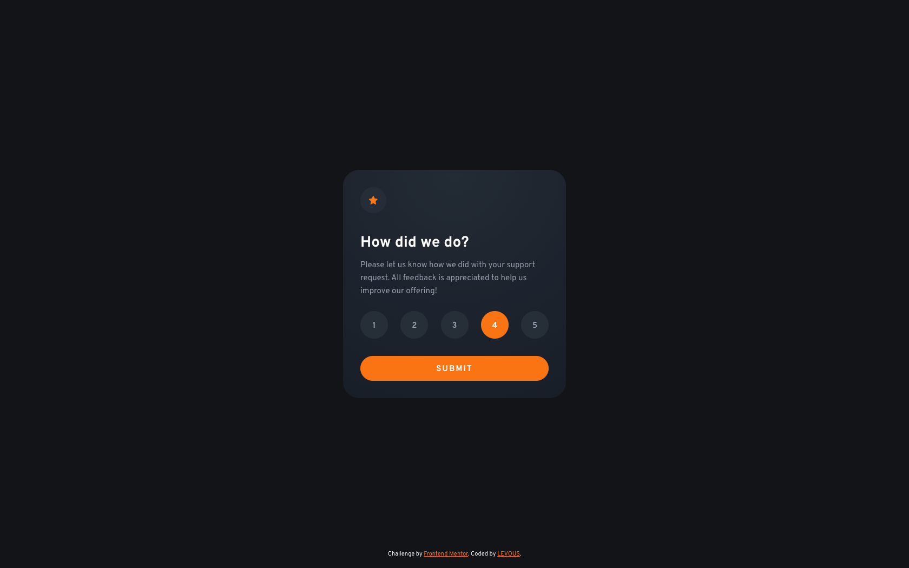

# Frontend Mentor - Interactive rating component solution

This is a solution to the [Interactive rating component challenge on Frontend Mentor](https://www.frontendmentor.io/challenges/interactive-rating-component-koxpeBUmI). Frontend Mentor challenges help you improve your coding skills by building realistic projects.

## Table of contents

- [Frontend Mentor - Interactive rating component solution](#frontend-mentor---interactive-rating-component-solution)
  - [Table of contents](#table-of-contents)
  - [Overview](#overview)
    - [The challenge](#the-challenge)
    - [Screenshot](#screenshot)
    - [Links](#links)
  - [My process](#my-process)
    - [Built with](#built-with)
    - [What I learned](#what-i-learned)
    - [Continued development](#continued-development)
  - [Author](#author)
  - [Acknowledgments](#acknowledgments)


## Overview

### The challenge

Users should be able to:

- View the optimal layout for the app depending on their device's screen size
- See hover states for all interactive elements on the page
- Select and submit a number rating
- See the "Thank you" card state after submitting a rating

### Screenshot



### Links

- Solution URL: [Add solution URL here](https://your-solution-url.com)
- Live Site URL: [Add live site URL here](https://your-live-site-url.com)

## My process

### Built with

- Semantic HTML5 markup
- CSS custom properties
- Flexbox/Grid
- [CUBE CSS](https://cube.fyi/) - Methodology for writing CSS (*like BEM*)
- Good ole vanilla JS

### What I learned

For me this is the start of a project to build a various components and apps first in vanilla JS and then in frameworks such as Vue, React and Svelte. This component is the vanilla JS version.

**A new approach to CSS**
I'm also learning [CUBE CSS](https://cube.fyi/), a new methodology for writing CSS by [Andy Bell](https://twitter.com/piccalilli_). So if you see a weird usage of angle brackets in my markups classes, that's why.

Here for instance I am grouping some of my classes in the CUBE CSS style:
```html
<section class="[ flow ] [ pa-32 ] [ card__content ]" id="rating-select">
```

- Composition
- Utility
- Block
- Exception

**A new accessibility best practice**
Originally my solution did not use a fieldset or radio buttons to select the rating. Someone was kind enough to point out that using a fieldset would provide a better user-experience for those with accessibility requirements.

The CSS I used to achieve the same design using radio buttons might be useful to some, as custom radio buttons can be tricky. Search for the comment **custom radio buttons** in `styles/main.css`.


### Continued development

I'm going to continue practising the CUBE CSS approach and build out a more complete system with it on larger projects, perhaps integrating Tailwind for the Utilities.


## Author

- Frontend Mentor - [LEVOUS](https://www.frontendmentor.io/profile/squaredindex)


## Acknowledgments

Thanks to Grace on the Frontend Mentor slack for suggesting to use a fieldset/radio buttons and thanks to arranrp and [Ben Myers](https://benmyers.dev/) for some further accessibility feedback.

